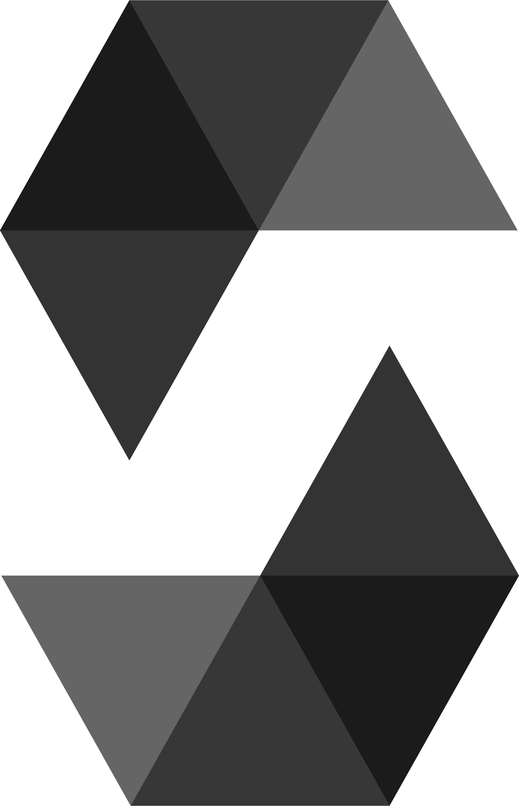
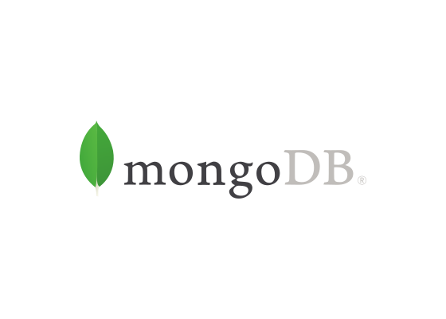

# Hi I'm Salo Serfati! 👋
[][twitter]
[][linkedin]
 

## I'm a full stack developer, entreprenuer, and blockchain/philanthropy enthusiast ⚒️

- I currently have two projects I am working on, [myTenPercent](#myTenPercent) and [GrooveTree](#GrooveTree). I currently work as a backend engineer at BlackRock. I was previously on the founding team of [Forage](https://www.joinforage.com). 

- I studied CIS at the University of Pennsylvannia. I am also a [Chainshot](https://www.chainshot.com/bootcamp) graduate, where I learned the skills necessary to be an effective Ethereum smart contract developer.  

- Here is [📚 my reading list](https://www.goodreads.com/review/list/141243083-salo-serfati?utf8=%E2%9C%93&utf8=%E2%9C%93&ref=nav_mybooks&shelf=read&view=covers&title=salo-serfati&per_page=infinite) and some of [🎨 my creative work]()

## My current stack and tools

  
  
  
  
  

   
 

## :pushpin: My projects

<h3>myTenPercent</h3>

[myTenPercent](https://mytenpercent.mailchimpsites.com/) is a neobank for your charitable dollars. Deposit how much money you want to donate to charity and then as issues/causes come up, use this neobank to make your donations. This allows you to see all your charitable donations in one place and nudges people to start thinking critically about the places they give to. To date, myTenPercent has processed 66 donations totaling $6,304 and 32 deposits totaling $12,029. 

&nbsp;

<h3>GrooveTree</h3>

GrooveTree creates composable music NFTs ([5 min demo](https://www.loom.com/share/c4b7ce1967cb47fb9d7817e28e78a9ce)). GrooveTree was build using two Solidity contracts developed on hardhat ([repo](https://github.com/gerantonyk/groovetree-hardhat)). The frontend was built on React, which also is responsible for storing the NFT's metadata in IPFS ([repo](https://github.com/mugungalabz/groovetree)). Groovetree was developed as a team of three.  

[linkedin]: https://www.linkedin.com/in/salomon-serfati-8ba836112/
[twitter]:https://twitter.com/salomonserfati

<!---
salo1serfati/salo1serfati is a ✨ special ✨ repository because its `README.md` (this file) appears on your GitHub profile.
You can click the Preview link to take a look at your changes.
--->
